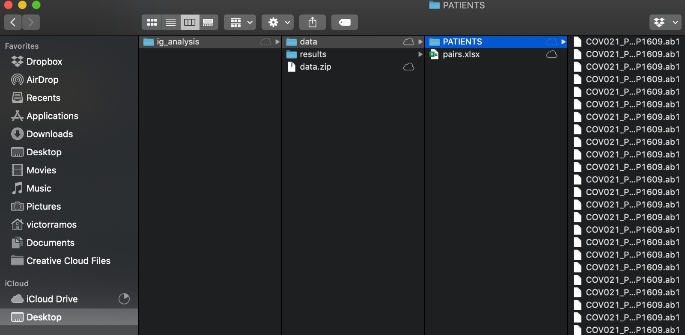

# Antibody Analysis - IgPipeline 2

This is modified version of the original IgPipeline, allowing the use of different isotypes (IgG, IgM and IgA). It was first used in the following publication:

- [Wang Z, Lorenzi JCC, Muecksch F, et al. **Enhanced SARS-CoV-2 neutralization by dimeric IgA.** *Sci Transl Med.* 2021;13(577):eabf1555. doi:10.1126/scitranslmed.abf1555](https://stm.sciencemag.org/content/13/577/eabf1555.full)

The same pipeline was used to analyze antibody evolution between two timepoints as described in our publication:

- [Gaebler C, Wang Z, Lorenzi JCC, et al. **Evolution of antibody immunity to SARS-CoV-2.** *Nature.* 2021;10.1038/s41586-021-03207-w. doi:10.1038/s41586-021-03207-w](https://www.nature.com/articles/s41586-021-03207-w)

Sequences from timepoints 1.3 months and 6.2 months were placed in the IgG and IgM slots of this pipeline,and the figures labels were modified manually using Adobe Illustrator. 


---


#### Table of Contents  
* [Docker Installation](#installing-docker-desktop-on-macos-and-windows)
* [Docker Execution](#executing-igpipeline)


## Installing Docker Desktop on macOS and Windows

On the official [Docker website](https://www.docker.com/products/docker-desktop), click on the button **"Download for Mac"** for macOS users or **"Download for Windows"** for Windows OS users.


Regardless the selected OS, a new web page will be open and the dmg file can be downloaded clicking on the button **"Get Docker"**


The same web page describes:

## Install it on macOS
Double-click Docker.dmg to start the install process.

When the installation completes and Docker starts, the whale in the top status bar shows that Docker is running, and accessible from a terminal.


## Install it on Windows
Double-click Docker for Windows Installer to run the installer.

When the installation finishes, Docker starts automatically. The whale  in the notification area indicates that Docker is running, and accessible from a terminal.

## Executing IgPipeline

#### Step 1:

Once Docker is installed, download the image containing the IgPipeline on https://hub.docker.com/r/stratust/igpipeline2
  

Open up a terminal session and download the image using the command **docker pull stratust/igpipeline2**  
  

<br/>

#### Step 2:
In Desktop, create a folder named "ig_analysis". Inside this folder, download and extract the zip file available through the links below. 
- [Dataset for: Wang Z, Lorenzi JCC, Muecksch F, et al. **Enhanced SARS-CoV-2 neutralization by dimeric IgA.** *Sci Transl Med.* 2021;13(577):eabf1555. doi:10.1126/scitranslmed.abf1555](http://gofile.me/4kSgZ/llhDH7WfE)

- [Dataset for: Gaebler C, Wang Z, Lorenzi JCC, et al. **Evolution of antibody immunity to SARS-CoV-2.** *Nature.* 2021;10.1038/s41586-021-03207-w. doi:10.1038/s41586-021-03207-w](http://gofile.me/4kSgZ/fUwS7JEOn)

- [Data set for: Alice Cho, Frauke Muecksch, Dennis Schaefer-Babajew, et al. **Antibody Evolution after SARS-CoV-2 mRNA Vaccination** *bioRxiv* 2021; 10.1101/2021.07.29.454333 ](https://www.dropbox.com/s/gr0r7cz14xmhkxp/VAX_MANUSCRIPT_ab1.zip?dl=0)


Also create a folder named "results".
  

<br/>

#### Step 3:
* To load a container using the downloaded docker image, open up a terminal session and type:
<br/>

```
docker run -it -v ~/Desktop/ig_analysis/data:/igpipeline/data -v ~/Desktop/ig_analysis/results:/igpipeline/results stratust/igpipeline2:latest
``` 
<br/>

* Right after the container is loaded, to start the pipeline execution type: 
```
snakemake -j 1
```

- If you have enough computing resources to parallelize the execution, specify the parameter -j < number_of_cores > for the snakemake.
```
snakemake -j 4
```

<br/>

 

<br/>


<br/>

That's it ! The IgPipeline2 is executing.
  

<br/>

#### Step 4:
Once the execution finishes, the results will be available in the folder "results"
  

<br/>


