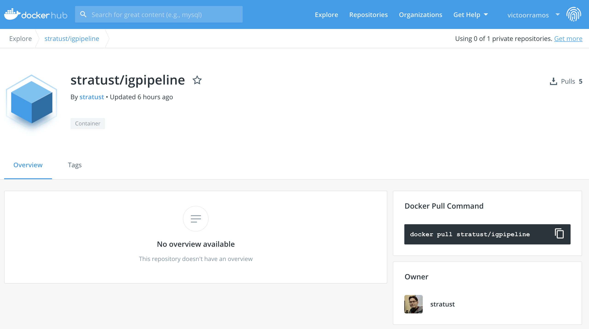
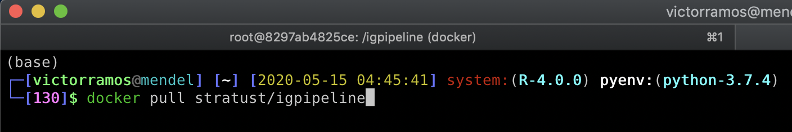
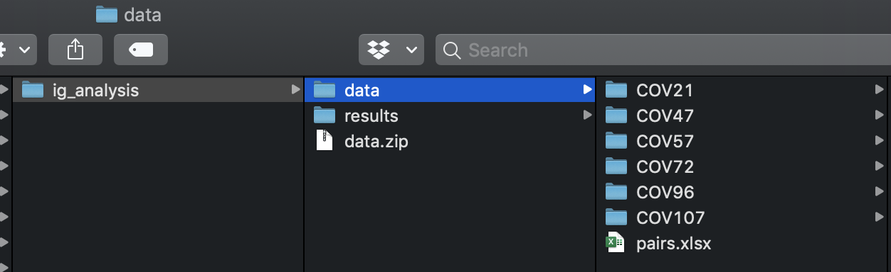
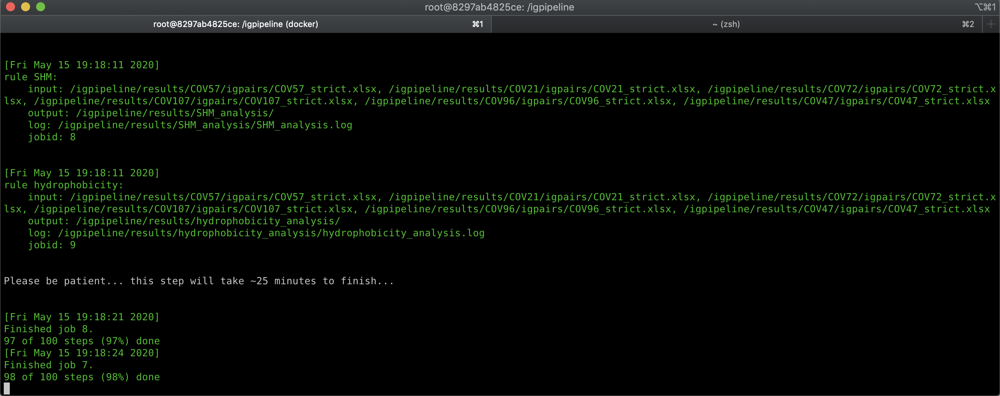
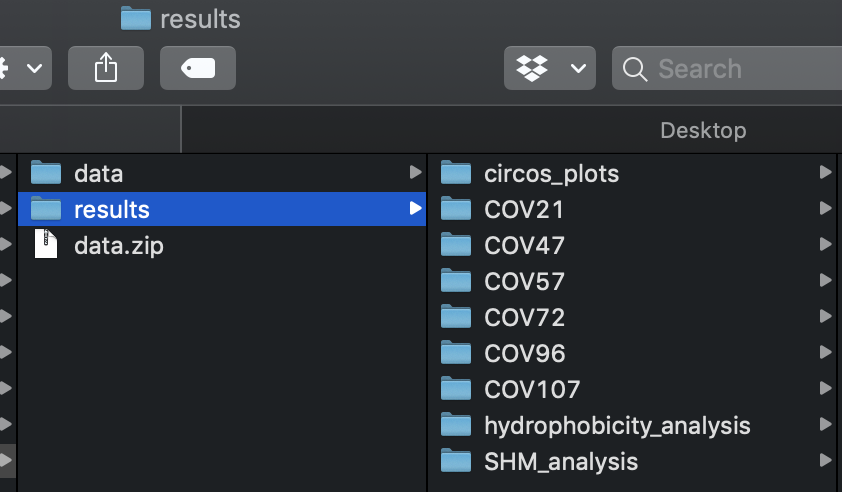

# Antibody Analysis

#### Table of Contents  
* [Docker Installation](#installing-docker-desktop-on-macos-and-windows)
* [Docker Execution](#executing-igpipeline)

## Installing Docker Desktop on macOS and Windows

On the official [Docker website](https://www.docker.com/products/docker-desktop), click on the button **"Download for Mac"** for macOS users or **"Download for Windows"** for Windows OS users.

Regardless the selected OS, a new web page will be open and the dmg file can be downloaded clicking on the button **"Get Docker"**

The same web page describes:

## Install it on macOS
Double-click Docker.dmg to start the install process.

When the installation completes and Docker starts, the whale in the top status bar shows that Docker is running, and accessible from a terminal.

## Install it on Windows
Double-click Docker for Windows Installer to run the installer.

When the installation finishes, Docker starts automatically. The whale  in the notification area indicates that Docker is running, and accessible from a terminal.

## Executing IgPipeline
#### Step 1:
Once Docker is installed, download the image containing the IgPipeline on https://hub.docker.com/r/stratust/igpipeline
  

Open up a terminal session and download the image using the command **docker pull stratust/igpipeline**  
  

 

#### Step 2:
Create a folder in any directory named "ig_analysis". Inside this folder, download and extract the zip file available through [this link](https://rockefeller.app.box.com/s/vboi2buc769w7r1yo6vhpcxnfcbbn807) and create a folder named "results"  
  

 

#### Step 3:
Open up a terminal session and type **docker run -it -v < path_to_data_folder >:/igpipeline/data -v < path_to_results_folder >/igpipeline/results stratust/igpipeline:latest** to load a container with the downloaded image and type **snakemake --until SHM** to start the pipeline execution
  

 

#### Warnings
- In the hydrophobicity analysis we calculate the GRAVY score for 22,654,256 IGH CDR3 sequences from a public database of memory B-cell receptor sequences (doi:10.1371/journal.pone.0160853), which requires plenty of computing resources and it takes ~30 min to execute. Using the command provided above this step **WILL NOT** be executed. If you want to execute the hydrophobicity score calculation, run the pipeline with the command **snakemake**

- If you have enough computing resources to parallelize the execution, specify the parameter -j < number_of_cores > for the snakemake.

 

That's it ! The IgPipeline is executing.
  

 

#### Step 4:
Once the execution finishes, the results will be available in the folder "results"
  

 

